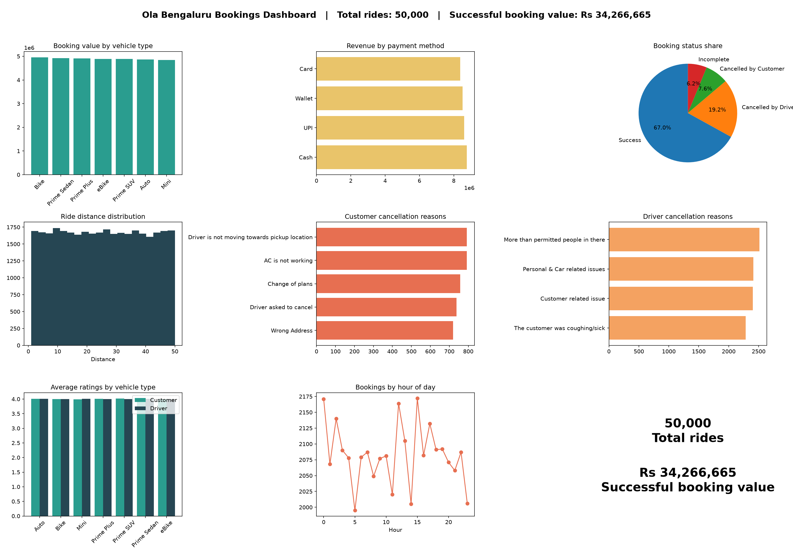

# Ola Booking Analysis (SQL + Python)

SQL and Python analysis of 50,000 Ola ride bookings in Bengaluru: cancellations, revenue, ratings and a dashboard.

## Tools
Python, SQLite, pandas, matplotlib

## Dataset
Bengaluru Ola booking data (50,000 rows, 21 columns): https://github.com/Satyam638/OLA_DataAnalyst_Project

Based on the GeeksforGeeks tutorial: https://www.geeksforgeeks.org/sql/ola-data-analysis-with-sql/

I used SQLite and Python instead of MySQL Workbench and Power BI, and added my own queries and charts.

## Project files
- `load.py` loads the CSV into a SQLite database (`ola.db`)
- `run_queries.py` runs 15 SQL queries (10 from the tutorial and 5 of my own)
- `dashboard.py` builds the dashboard image from the database

## How to run
1. Download the CSV from the dataset link into this folder
2. Install the libraries: `pip install pandas matplotlib`
3. Create the database: `python load.py`
4. Run the queries: `python run_queries.py`
5. Build the dashboard: `python dashboard.py` (saves `screenshots/ola_dashboard.png`)

## Key insights
- 67.0% of the 50,000 bookings were successful. Drivers cancelled 19.2% of bookings, customers cancelled 7.6%, and 6.2% of rides were incomplete, so driver cancellations were the biggest source of lost rides.

## Analysis covered
- Booking status breakdown and cancellation rates
- Revenue by payment method and by vehicle type
- Booking patterns by hour of day
- Customer and driver cancellation reasons
- Average customer and driver ratings by vehicle type
- Top customers by number of rides and by spend (window function)
- Ride distance distribution
